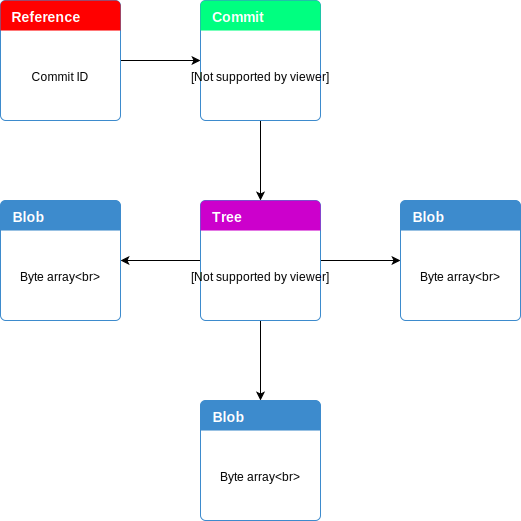

# Gracker - Git based Issue Tracker

## Terminology

### id
The id of issue, must be the same name as `reference`.  

### reference
The actual existence in `git`, similar to `branch`, we use it as tracking object for individual issue.  
The name of reference is used as `id`.  

The content of which will point to the `latest commit` object id.  

### commit
The actual existence in `git`, this contains basic commit information, including  
1. `tree` object id  
2. Committer, time  
3. Author, time  
4. `status`  

### tree
The actual existence in `git`, this contains  
1. title  
2. body  
3. label  

### blob
The actual existence in `git`, this contains the actual content in byte array format.  
Everything like title, body, label, tree, commit are in this format.  

